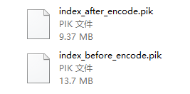
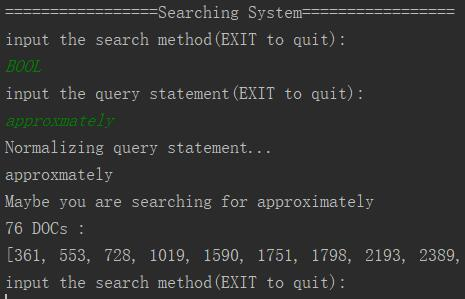

# 信息检索系统

利用倒排索引和向量空间模型实现的信息检索系统。

## 完成工作以及分工：
- 马哲：
    - 语言分析
    - 拼写矫正
- 袁德华：
    - 带位置信息的倒排索引
    - 索引压缩
- 宋鼎：
    - BOOL查询
    - 短语查询
- 姚婧、徐维亚：  
    - 向量空间模型
    - TOP K查询

# 运行
环境要求：python3 
语料库需自行下载放置于`./LanguageAnalysis/Reuters`中，该文件夹中包含所有docID.html文件。

> 注意：运行前请不要修改工程文件的名字和相对位置

运行方式：
```commandline
python main.py
```
## 运行输入与输出
- The first time to load this System?[Y]/[N]
    - 第一次运行需要输入Y，构建向量空间
    - 之后运行请输入N继续
### 布尔查询、短语查询
- input the search method(EXIT to quit):
    - 输入：BOOL
- input the query statement(EXIT to quit):
    - 布尔输入样例（NOT AND OR需要大写）：NOT word1 AND word2 OR word3
    - 优先级NOT > AND > OR，可以使用括号更改优先级
    - 短语查询直接输入需要查询短语
    - 布尔输入中可以存在短语 ：NOT word1 AND word2 word3
- 输出
    - 首先输出拼音矫正结果，再输出查询结果（文档数目+文档列表）
### TOP-K 查询
- input the search method(EXIT to quit):
    - 输入：SCORE
- input the query statement(EXIT to quit):
    - 直接输入需要查询内容
- input the K:
    - 输入查询结果数量
- 输出
    - 拼音矫正结果
    - 文档名+文档得分
    - 文档内容中包含查询项的周围语句
    - 总结：文档数目+文档列表


# 实现功能
## 语言分析
* 利用python中自然语言处理的库：nltk对文章中的单词进行词条化、词干还原。
* 词干还原后我们编写了一个过滤器用以去除多余的标点符号，空白符，拆分词组等。
* 语言分析被用来做文档的预处理以及查询语句的预处理，还实现了一些获取文档属性值的接口供索引器调用。

## 倒排索引

### 索引构建

&emsp;&emsp;我们实现了基于哈希表的倒排索引，其索引节点的组织结构如下所示：

```python
{
    "item1":{
        "df" : 57,
        "doc_list": {
            "1": {
                "tf": 2,
                "position": [1, 4]
            },
            ...
        }

    },
    ···
}
```

&emsp;&emsp;通过结构图可以看出，每个词项作为哈希的键值，哈希节点即索引节点。索引节点存储了该词项的文档频率以及对应的文档列表，文档列表中又存储了该词项的在文档中的词频和位置信息。

### 索引压缩

&emsp;&emsp;我们实现了基于可变字节码的索引压缩。在将索引写到硬盘中的时候，我们会对索引一定的处理，处理后的索引结构如下：

```python
[
    "item1":[
        vbEncode(doc_id_distance_list)
        vbEncode(position_distance_list1),
        vbEncode(position_distance_list2),
        ...
    ],
    "item2":[
    ...
    ],
    ...
]
```

&emsp;&emsp;如上所示，我们首先对将文档ID列表转成距离列表，对位置信息做同样的处理，然后对这些距离列表使用可变字节码压缩，最后将其写到硬盘中。在每次加载时对其进行解码恢复，重新构建索引。
&emsp;&emsp;压缩效果如下所示：



&emsp;&emsp;压缩比率大致在68%。

## 向量空间模型

根据词项的df计算出idf，根据词项索引中每个doc的tf，计算相应的tf-idf。不在索引中的doc，该词项的tf-idf为0

遍历倒排索引表，可以得到所有tf-idf，即生成了向量空间模型

由于向量空间模型是一个稀疏矩阵，又非常的大，直接生成放在内存非常占用空间。
利用对稀疏矩阵的处理方法，保存这个向量空间模型，存入文件中
每次运行不需要再次生成向量空间，只需要导入即可

## TOP K 查询
首先通过向量空间模型得到所有文档的向量，和查询向量进行余弦相似度计算获得评分。

通过堆排序建好最大堆以后进行K次pop+precDown操作。

将pop得到的K个元素返回。

## 短语查询
利用带位置信息的倒排索引获得出现每一个单词的文档列表，接着取所有文档列表的交集。

从这个文档集中根据位置索引查找是否有匹配的短语。

具体查找方式：遍历第一个词项在文档中的位置，依次检测后面的词项位置中是否包含与其匹配的位置。

```
def search_bool_phrase(index, word_list, flag):
    if len(word_list) == 0:
        return []
    #找词
    doc_queue = queue.Queue()
    for word in word_list:
        doc_queue.put(search_single_word(index, word))
    #取交集
    while doc_queue.qsize() > 1:
        list1 = doc_queue.get()
        list2 = doc_queue.get()
        doc_queue.put(operateDocList.and_list(list1, list2))
    doc_list = doc_queue.get()
    #NOT情况
    if len(word_list) == 1:
        if flag:
            return doc_list
        else:
            return operateDocList.minus_list(tools.wholeDocList, doc_list)

    res_list = []
    #根据位置索引查找匹配
    for doc_id in doc_list:
        # doc_id = str(doc_id)
        # print(index[word_list[0]]["doc_list"])
        for loc in index[word_list[0]]["doc_list"][doc_id]["positions"]:
            file_loc = loc
            has_find = True
            for word in word_list[1:len(word_list)]:
                file_loc += 1
                try:
                    index[word]["doc_list"][doc_id]["positions"].index(file_loc)
                except:
                    has_find = False
                    break
            if has_find:
                res_list.append(int(doc_id))
                break
    if flag:
        return res_list
    else:
        return operateDocList.minus_list(tools.wholeDocList, res_list)
```

## BOOL查询

- 将中缀查询表达式通过栈操作转为后序表达式：如 A OR B AND C 转为 A B C AND OR 
- 同时完成短语划分，如A B AND C将被转为[[A B],[C],[AND]]
- 计算后缀表达式，其中search.search_bool_phrase方法即短语查询方法，flag表示是否需要取反集
```
        if item != 'AND' and item != 'OR':
            if i < limit - 1:
                if postfix[i + 1] == "NOT":
                    i = i + 1
                    result.append(search.search_bool_phrase(index, item, flag=False))
                else:
                    result.append(search.search_bool_phrase(index, item, flag=True))
            else:
                result.append(search.search_bool_phrase(index, item, flag=True))
        elif item == 'AND':
            if len(result) < 2:
                print("illegal query")
                return []
            else:
                list1 = result.pop()
                list2 = result.pop()
                result.append(listSort.and_list(list1, list2))
        elif item == 'OR':
            if len(result) < 2:
                print("illegal query")
                return []
            else:
                list1 = result.pop()
                list2 = result.pop()
                result.append(listSort.merge_list(list1, list2))
```


## 拼写矫正
拼写矫正模块对语言分析模块处理完毕的查询语句进行拼写检查以及矫正。

模块采用如下的工作流程：

1. 如果输入词在词典里找到了原词，不需要拼写矫正，返回
2. 发现词典中不存在的词，则计算与词典中每一个词的编辑距离
3. 找到编辑距离最小的相近词，若编辑距离小于等于2，则替换，否则返回None

模块的核心是编辑距离的计算，这里采用了动态规划的算法，核心代码如下：

```
    for i in range (1, len(word_pair[0]) + 1):
        for j in range (1, len(word_pair[1]) + 1):
            if word_pair[0][i - 1] == word_pair[1][j - 1]:
                m[i][j] = min(m[i - 1][j] + 1, m[i][j - 1] + 1, m[i - 1][j - 1])
            else:
                m[i][j] = min(m[i - 1][j] + 1, m[i][j - 1] + 1, m[i - 1][j - 1] + 1)
    return m[len(word_pair[0])][len(word_pair[1])]

```

例如对单词approxmately的纠正，错误纠正模块能够返回正确的拼写approximately:




